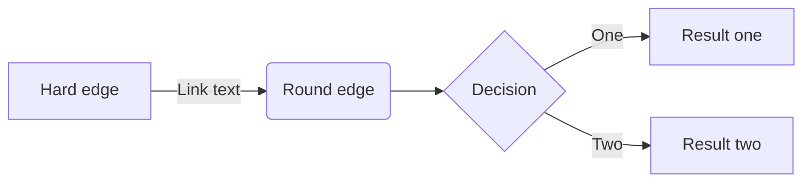

I am very tiered so not writing a good description. Need to sleep, as numerous people have pointed out.

If you want to play with the notes, look to your left, the explorer thingy, yea, click on that, you'll find the lecture notes I've been working on.

You can read it, or not, better articles coming soon, I guess. I also need to move this to a better site, github pages ain't gonna cut it.


```py
import some_stuff
print("Testing some code and stuff")
print("Just ignore this")
```


```js
console.log("Some good good JS testing")
```

<!-- generate a mermaid graph -->

Can it do mermaid graphs?



Woah, it can! Nice.


Ok, I am going to sleep now.

-Pranav
